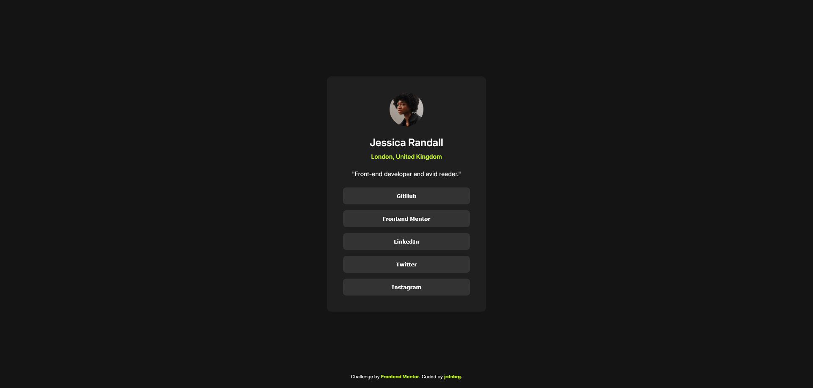

# Frontend Mentor - Social links profile solution

This is a solution to the [Social links profile challenge on Frontend Mentor](https://www.frontendmentor.io/challenges/social-links-profile-UG32l9m6dQ). Frontend Mentor challenges help you improve your coding skills by building realistic projects. 

## Table of contents

- [The challenge](#the-challenge)
- [Screenshot](#screenshot)
- [Links](#links)
- [Built with](#built-with)

## The challenge

Users should be able to:

- See hover and focus states for all interactive elements on the page

## Screenshot

## Links

- Solution URL: https://www.frontendmentor.io/solutions/social-links-profile-_oxH4Pc7Zq
- Live Site URL: http://jrdnbrg.github.io/social-links-profile/

## My process

## Built with

- Semantic HTML5 markup
- Flexbox